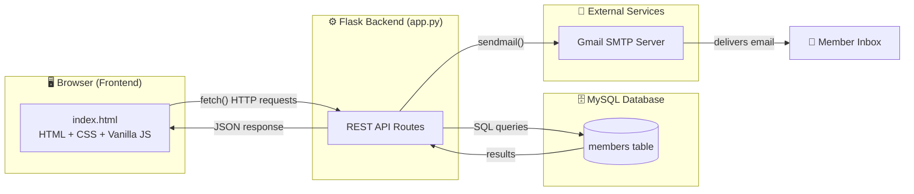
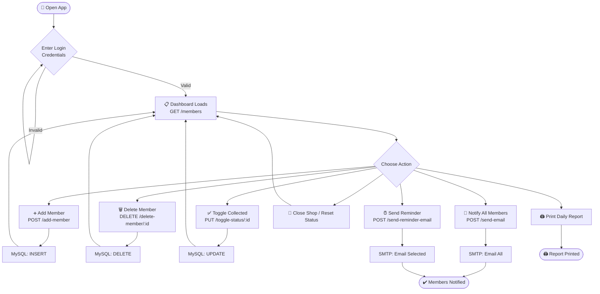

<div align="center">

[](https://git.io/typing-svg)


</div>

---

## 📖 About the Project

**Ration Shop Management System** is a lightweight web application built to help a Fair Price Shop (ration shop) admin digitally manage registered members, track who has collected their monthly ration, and broadcast notifications (shop open/close, reminders) to members via email — replacing manual registers and word-of-mouth announcements.

It's a single-admin dashboard: the shop owner logs in, views all registered members, adds or removes members, marks ration as collected, and sends bulk email notifications — all from one page.

---

## ✨ Key Features

| Feature | Description |
|---|---|
| 🔐 **Admin Login** | Simple username/password gate before the dashboard loads |
| 👥 **Member Management** | Add, view, search, and delete registered ration card holders |
| ✅ **Collection Tracking** | Toggle each member's ration as *Collected* / *Not Collected* |
| 📧 **Bulk Email Notifications** | Notify all members at once when the shop opens |
| ⏰ **Reminder Emails** | Send targeted reminder emails to selected members |
| 🖨️ **Daily Report Printing** | Generate and print a daily distribution report |
| 🔄 **Shop Reset** | Reset all member statuses back to *Not Collected* for the next cycle |

---

## 🏗️ System Architecture



---

## 🔄 Application Flow



---

## 🗂️ Project Structure

```
Rationshop/
├── app.py                  # Flask backend — routes, DB & email logic
├── requirements.txt        # Python dependencies
├── Procfile                # Deployment start command (e.g. Heroku/Render)
├── index.html               # Standalone copy of the frontend
├── templates/
│   └── index.html          # Main frontend served by Flask (Jinja template)
├── static/
│   └── images/
│       └── TNlogo.jpeg      # Branding / background watermark
└── README.md
```

---

## 🧩 Tech Stack

**Backend:** Python, Flask, Flask-CORS
**Database:** MySQL (via `mysql-connector-python`)
**Frontend:** HTML5, CSS3, Vanilla JavaScript (no framework)
**Notifications:** SMTP (Gmail) for email delivery
**Deployment:** Procfile included (Heroku / Render compatible)

---

## 🔌 API Reference

| Method | Endpoint | Purpose |
|---|---|---|
| `GET` | `/` | Serves the dashboard (`index.html`) |
| `GET` | `/members` | Fetch all registered members |
| `POST` | `/add-member` | Add a new member (`name`, `phone`, `email`) |
| `DELETE` | `/delete-member/<id>` | Remove a member by ID |
| `PUT` | `/toggle-status/<id>` | Toggle a member's ration-collected status |
| `POST` | `/send-email` | Email a message to **all** members |
| `POST` | `/send-reminder-email` | Email a reminder to a **specific list** of members |

---

## ⚙️ Getting Started

### Prerequisites
- Python 3.8+
- MySQL Server running locally
- A Gmail account with an **App Password** enabled (for SMTP)

### 1. Clone the repository
```bash
git clone https://github.com/Soorya-SS-01/Rationshop.git
cd Rationshop
```

### 2. Install dependencies
```bash
pip install -r requirements.txt
```

### 3. Set up the database
Create a MySQL database named `ration_db` with a `members` table:
```sql
CREATE DATABASE ration_db;

USE ration_db;

CREATE TABLE members (
    id INT AUTO_INCREMENT PRIMARY KEY,
    name VARCHAR(100) NOT NULL,
    phone VARCHAR(15),
    email VARCHAR(100),
    collected BOOLEAN DEFAULT FALSE
);
```

### 4. Configure database credentials
Update the database connection details in `app.py` to match your local MySQL setup (host, user, password, database name).

### 5. Configure email credentials
Update the sender email and app password in `app.py` with your own Gmail account and an [App Password](https://support.google.com/accounts/answer/185833) for SMTP access.

### 6. Run the app
```bash
python app.py
```
The app will be available at `http://127.0.0.1:5000`

---

## 🚀 Future Improvements

- [ ] SMS notifications via Twilio (dependency already included)
- [ ] Pagination/search optimization for large member lists
- [ ] Monthly auto-reset scheduler for collection status
- [ ] Deploy live demo link

---

## 👤 Author

**Soorya S S**
[GitHub](https://github.com/Soorya-SS-01) · [LinkedIn](https://www.linkedin.com/in/soorya-s-s-364839370)


